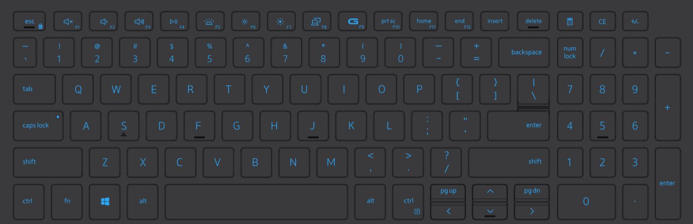
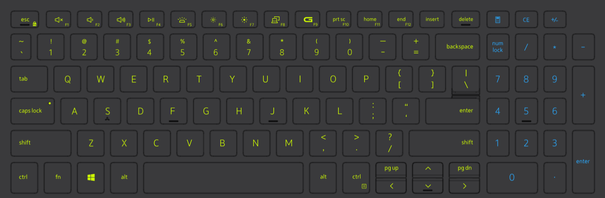
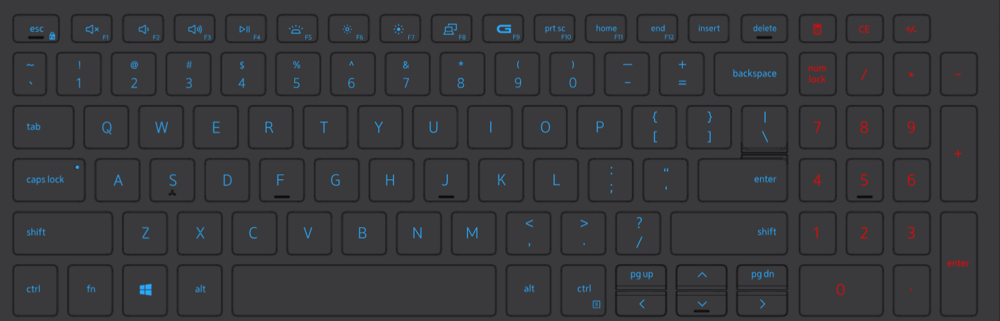

# CapsNumLockLightsKeys
Turn on certain keyboard lights when pressing caps lock or num lock for dell computers with alienware command center.

## Normal keyboard

## Caps Lock ON

## Num Lock OFF

## Windows autostart
Put the .exe in 'shell:startup' folder

## Enbale AlienFX API
To work it is necessary to enable the AlienFX API in the settings in the Alienware Command Center app.

I'm not a c++ developer, but I made this code for my own use. Tested on Dell G15 Notebook, but it should work on other Dell gamer models.
